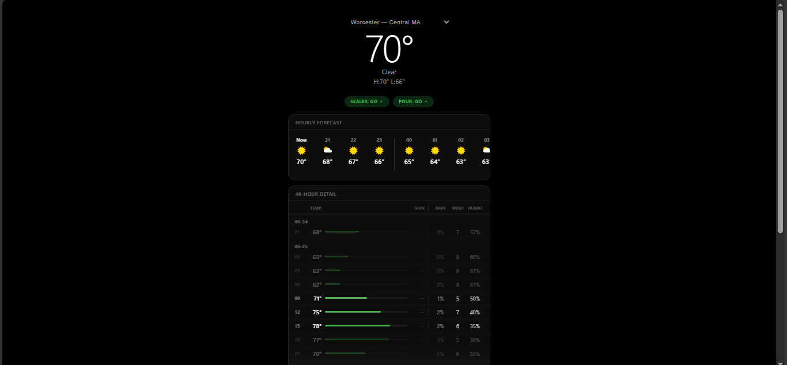

# Weather Intelligence Platform


I built a weather intelligence platform that my stamped concrete business uses every morning to decide if conditions are safe to pour, seal, or cure concrete. It pulls messy government weather data, cleans it, scores conditions green/yellow/red, and shows a 48-hour forecast on my phone.

**Live:** [weather.zeladoranalytics.com](https://weather.zeladoranalytics.com)



## What It Does

Concrete work is weather-sensitive. Too cold and it won't harden. Too hot and it cracks. Rain ruins a fresh pour. High wind dries the surface wrong. Sealer needs 24 hours of dry conditions before and after application.

Regular weather apps tell you "72°F, partly cloudy." This tool tells you **"Safe to pour between 9AM and 3PM"** or **"Do not seal — rain in last 24 hours."**

It scores five factors — temperature, humidity, wind, precipitation, and dew point — and gives a green/yellow/red verdict for pouring, sealing, and curing. Tap the verdict to see exactly which factor triggered it and what the thresholds are.

## What Makes It a Data Engineering Project

This isn't a weather API wrapper. The data starts as raw government files in a format so messy most people can't use them:

- **Fixed-width text files** (not CSV) where each value is packed into positional columns
- **Missing values coded as `-9999`** instead of null
- **Temperature in tenths of degrees Celsius**, precipitation in tenths of millimeters
- **Quality flags** that must be checked per measurement — bad readings get filtered out
- **Stations go offline** without warning — gaps appear in the data randomly

The system cleans all of this, loads it into a database, validates it with automated tests, and transforms it into business-ready analytics.

## Business Impact

- **45 completed jobs** tracked against historical weather data
- **4 jobs identified** that were poured on red-flag weather days
- **September–October** confirmed as the best pour months (21% green days vs. 3% in July)
- **Worcester's longest dry streak**: 16 consecutive days (Aug 2-17, 2025) — a perfect sealer window
- Replaced morning weather-checking routine with a 5-second glance at the dashboard

## Architecture

```
NOAA Weather Data (messy)        Open-Meteo (live forecasts)
        ↓                                ↓
   Python ETL                    Redis Streams (every 15 min)
   (parse, clean, convert)       + NWS severe weather alerts
        ↓                                ↓
   PostgreSQL ──── Airflow ────→ BigQuery
   (operational)   (orchestration)  (analytical warehouse)
        ↓                                ↓
      dbt (10 models, 32 tests)    Tableau / ad-hoc queries
        ↓
   FastAPI + WebSocket
        ↓
   Dashboard (HTTPS)
   weather.zeladoranalytics.com
```

## Tech Stack

| Layer | Technology | Purpose |
|---|---|---|
| **Data Sources** | NOAA GHCN-Daily, Open-Meteo, NWS Alerts | Historical weather, forecasts, severe weather |
| **ETL** | Python, psycopg2 | Parse fixed-width files, convert units, filter quality flags |
| **Database** | PostgreSQL 16 | Operational store — 18,000+ daily observations, 45 jobs |
| **Transformations** | dbt (10 models, 32 tests) | Staging → intermediate → marts with automated validation |
| **Orchestration** | Apache Airflow (4 DAGs) | Daily ETL, hourly forecast cache, weekly backfill, BigQuery sync |
| **Streaming** | Redis Streams + WebSocket | Real-time weather updates every 15 min, NWS alert monitoring |
| **Warehouse** | Google BigQuery | Analytical layer — same data, optimized for Tableau and ad-hoc queries |
| **API** | FastAPI | REST endpoints + WebSocket for live dashboard updates |
| **CI/CD** | GitHub Actions | Lint (ruff + sqlfluff) → test (pytest + dbt) → deploy to EC2 |
| **Infrastructure** | AWS EC2, nginx, Let's Encrypt | HTTPS, reverse proxy, systemd services — $1.30/month |

## Data Quality

The system doesn't just load data — it validates it:

- **32 dbt tests**: referential integrity, accepted values, not-null constraints, uniqueness
- **3 custom assertions**: temperatures within realistic bounds (-40 to 120°F), no future dates, every job has matching weather
- **28 pytest unit tests**: scoring engine boundary values, None handling, best-window algorithm
- **Data coverage audit**: tracks per-station completeness (Worcester: 100%, Chicopee: 25.7%)
- **60 total automated tests** gate every deployment

## Analytical Queries

Eight SQL views power the analytics layer, demonstrating:

| Analysis | What It Finds | SQL Techniques |
|---|---|---|
| Temperature anomalies | Days where temp deviated >2σ from the rolling average | Window functions (AVG, STDDEV), CASE |
| Dry/wet streaks | Longest consecutive dry or rainy stretches | Gap-and-island technique, ROW_NUMBER |
| Seasonal patterns | Best months for concrete by station and year | FILTER clause, EXTRACT, percentages |
| Data quality audit | Missing data and coverage gaps per station | generate_series, LEFT JOIN |
| Year-over-year trends | Is the season getting warmer or colder? | LAG window function |
| Best work weeks | Top 5-day windows ranked by green days | Sliding window SUM, RANK |
| Station comparison | How often do two stations disagree on conditions? | Self-join, CORR() |
| Season boundaries | When does concrete season start and end each year? | ROW_NUMBER + FILTER, date arithmetic |

## API

| Endpoint | Description |
|---|---|
| `GET /` | Dashboard — mobile-friendly, real-time updates |
| `GET /api/v1/forecast/{town}` | 48h forecast with hourly pour scoring |
| `GET /api/v1/sealer-check/{town}` | Sealer safety: last 24h + next 24h |
| `GET /api/v1/cure-check/{town}` | 48h curing window (freeze, rain, heat, wind) |
| `GET /api/v1/weather/{town}/{date}` | Historical lookup from NOAA data |
| `GET /api/v1/jobs` | All jobs with weather correlation |
| `GET /api/v1/analytics/*` | 8 analytical endpoints (seasonal, streaks, anomalies, etc.) |
| `GET /api/v1/stream/status` | Real-time streaming health check |
| `WS /ws/live` | WebSocket — push-based weather updates |
| `GET /docs` | Interactive API documentation (Swagger) |

## Setup

```bash
git clone https://github.com/DMota18/weather-intel.git
cd weather-intel
python3 -m venv venv && source venv/bin/activate
pip install -r requirements.txt

# Set environment variables
export WI_DB_PASSWORD=your_password

# Create database, load data, run transformations
sudo -u postgres psql -f sql/schema.sql
cd etl && python 01_download_stations.py && python 02_parse_and_load.py
cd ../dbt_project && dbt run --profiles-dir . && dbt test --profiles-dir .

# Start the app
cd ../app && uvicorn main:app --host 0.0.0.0 --port 8000
```

## Tests

```bash
pytest tests/ -v                              # 28 Python tests
cd dbt_project && dbt test --profiles-dir .   # 32 data tests
```

## Coverage

10 weather stations covering Massachusetts from Cape Cod to Springfield, as far north as Lowell:

Hyannis (Cape Cod) · Plymouth (South Shore) · Taunton (SE MA) · New Bedford (South Coast) · Norwood (Metro South) · Worcester (Central MA) · Fitchburg (North Central) · Lawrence/Lowell (Merrimack Valley) · Springfield (Pioneer Valley) · Westfield (Western MA)
